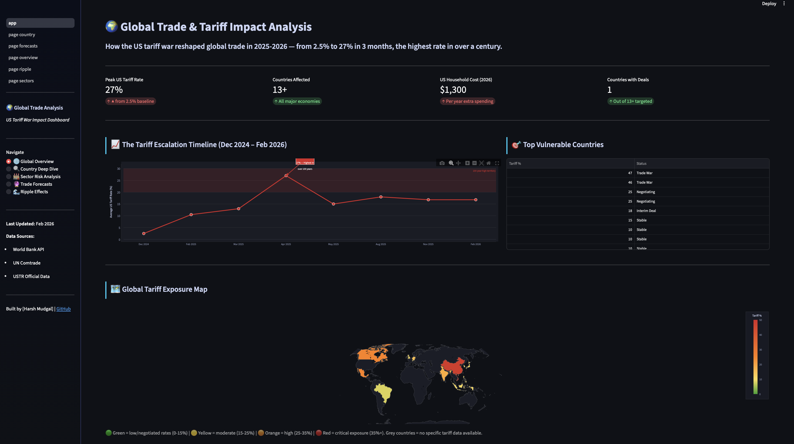
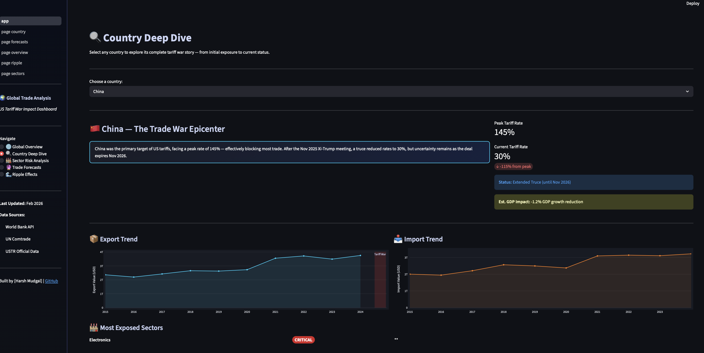
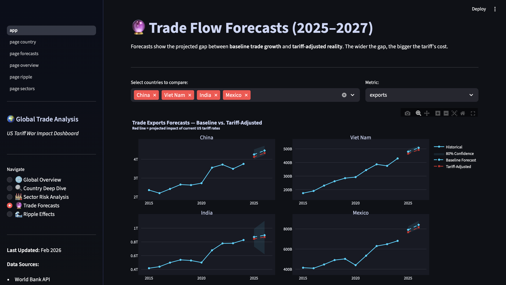
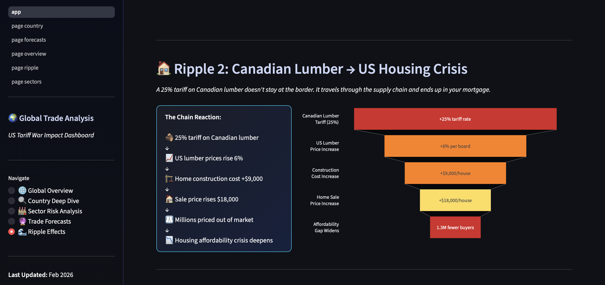
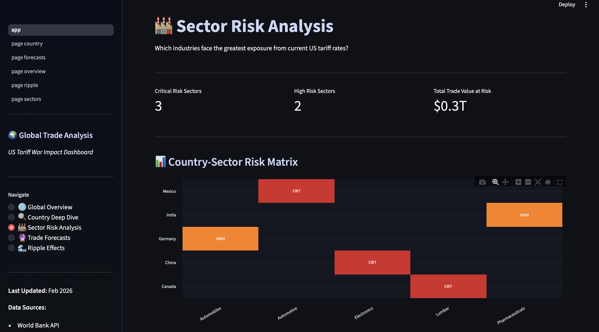

# 🌍 Global Trade & Tariff Impact Analysis


An interactive dashboard analyzing the 2025-2026 US tariff war — the most significant trade policy shift in over a century, with average tariff rates reaching 27% (up from 2.5%).

**[**[Live Demo: ](https://global-trade-tariff-analysis-cxqskiv3tulffaw3diezuz.streamlit.app/)| **[View Dashboard Screenshots](#screenshots)**]

---

## 📊 Project Overview

This project provides comprehensive analysis of how US tariff policies (2025-2026) affected global trade flows, focusing on:

- **Trade Flow Forecasting**: Predictive models showing baseline vs. tariff-adjusted trade trajectories
- **Country Vulnerability Scoring**: Risk assessment combining tariff rates, trade dependency, and deal status
- **Sector Exposure Analysis**: Industry-level impact across automotive, electronics, pharmaceuticals, and more
- **Ripple Effect Mapping**: How tariffs cascade through supply chains (e.g., Canadian lumber → US housing costs)

### Key Features

✅ **Real-time Data Integration**: Automated pipeline from World Bank API and UN Comtrade  
✅ **Interactive Visualizations**: 9+ Plotly charts with drill-down capabilities  
✅ **Forecasting Engine**: Prophet-based models with tariff impact adjustments  
✅ **14 Country Profiles**: Deep-dive analysis from China to Vietnam  
✅ **Multi-page Dashboard**: Built with Streamlit for easy navigation  

---

## 🎯 Business Impact

**Problem**: The 2025-2026 tariff war created unprecedented uncertainty for businesses, policymakers, and investors. Tariff rates hit 100-year highs, affecting $3+ trillion in annual trade.

**Solution**: This dashboard consolidates fragmented trade data into actionable insights, allowing users to:
- Assess exposure by country and sector
- Forecast trade flow changes under different tariff scenarios
- Identify supply chain vulnerabilities before they become crises

**Use Cases**:
- **Supply Chain Managers**: Evaluate manufacturing location decisions
- **Policy Analysts**: Track negotiation outcomes and economic impacts
- **Investors**: Identify sectors and countries with highest/lowest risk
- **Economists/Students**: Understand real-world trade war dynamics

---

## 🛠️ Technical Stack

### Data Pipeline
- **Python 3.9+**: Core data processing and analysis
- **Pandas**: Data manipulation and transformation
- **Requests**: World Bank API integration
- **Prophet**: Time series forecasting (Facebook's library)

### Visualization & Dashboard
- **Streamlit**: Interactive web dashboard framework
- **Plotly**: Dynamic, interactive charts and maps
- **Plotly Express**: Simplified charting for quick visualizations

### Data Sources
- **World Bank API**: Trade volumes, GDP, baseline tariff rates (2015-2024)
- **UN Comtrade**: Sector-specific trade data
- **USTR Official Data**: 2025-2026 tariff schedules and policy changes
- **Tax Foundation & Peterson Institute**: Economic impact estimates

---

## 📁 Project Structure
```
global-trade-analysis/
│
├── data/
│   ├── raw/                      # Original downloaded datasets
│   ├── processed/                # Cleaned, merged data
│   │   ├── trade_data_global.csv
│   │   ├── trade_forecasts.csv
│   │   └── trade_war_final_2026.csv
│   └── reference/                # Manual reference files
│       ├── trade_war_master.csv  # Country tariff profiles
│       ├── trade_war_events.csv  # Timeline of events
│       └── sector_exposure.csv   # Sector risk data
│
├── src/
│   ├── data_fetcher.py          # World Bank API wrapper
│   ├── metrics.py               # Volatility, exposure calculations
│   ├── forecasting.py           # Prophet models
│   ├── vulnerability_scorer.py  # Country risk scoring
│   └── impact_calculator.py     # Price impact simulations
│
├── notebooks/
│   ├── 01_api_exploration.ipynb
│   ├── 02_data_cleaning.ipynb
│   ├── 03_initial_dataset.ipynb
│   ├── 04_global_tariff_war_visuals.ipynb
│   ├── 06_forecasting.ipynb
│   ├── 07_sector_analysis.ipynb
│   └── 08_ripple_effects.ipynb
│
├── dashboard/
│   ├── app.py                   # Main Streamlit app
│   └── pages/
│       ├── page_overview.py     # Global overview
│       ├── page_country.py      # Country deep dives
│       ├── page_sectors.py      # Sector analysis
│       ├── page_forecasts.py    # Trade forecasts
│       └── page_ripple.py       # Ripple effects
│
├── reports/                      # Generated visualizations
│   ├── viz1_escalation_timeline.html
│   ├── viz2_vulnerability_scores.html
│   └── ... (9 total charts)
│
├── requirements.txt
├── README.md
└── LICENSE
```

---

## 🚀 Getting Started

### Prerequisites
- Python 3.9 or higher
- pip package manager

### Installation

1. **Clone the repository**
```bash
git clone https://github.com/harshmudgal13/global-trade-tariff-analysis
cd global-trade-tariff-analysis
```

2. **Create virtual environment** (recommended)
```bash
python -m venv venv
source venv/bin/activate  # On Windows: venv\Scripts\activate
```

3. **Install dependencies**
```bash
pip install -r requirements.txt
```

4. **Run the dashboard**
```bash
cd dashboard
streamlit run app.py
```

The dashboard will open in your browser at(https://global-trade-tariff-analysis-cxqskiv3tulffaw3diezuz.streamlit.app/)

---

## 📊 Key Insights & Findings

### 1. The Escalation (Dec 2024 - Apr 2025)
- US average tariff rate went from **2.5% → 27%** in 3 months
- April 2, 2025 "Liberation Day" marked the highest tariff rate in **over 100 years**
- 180+ countries affected by universal baseline tariff

### 2. Country-Specific Impacts
- **China**: Hit with 145% peak tariff, reduced to 30% after Nov 2025 truce
- **Vietnam**: 46% tariff — highest of any country without a deal (the "paradox economy")
- **India**: Most recent development (Feb 2026) — secondary tariff lifted, interim deal at 18%
- **Canada/Mexico**: 25% despite USMCA — strained relationships with closest allies

### 3. Sector Vulnerabilities
- **Critical Risk**: Chinese EVs (100% tariff), Vietnamese electronics (46%), Canadian lumber (25%)
- **High Risk**: Indian pharmaceuticals (supplies 40% of US generics), Mexican auto parts
- **Ripple Effects**: Canadian lumber tariffs → +$18,000 US home prices

### 4. Forecasting Results
- **Without tariffs**: Trade flows projected to grow 3-5% annually
- **With current tariffs**: Growth reduced to 0-2% or negative
- **Gap = Economic cost**: $200B-300B in foregone trade annually

---

## 🎓 Methodology

### Data Collection
1. Automated daily pulls from World Bank API (exports, imports, GDP, inflation)
2. Manual compilation of official tariff schedules from USTR
3. Cross-validation against UN Comtrade data

### Vulnerability Scoring Algorithm
```
Vulnerability Score (0-100) = 
    (Tariff Rate × 0.50) + 
    (Trade Dependency × 0.30) + 
    (Deal Status Score × 0.20)
```

### Forecasting Approach
- **Model**: Facebook Prophet with custom seasonality
- **Training Data**: 2015-2024 historical trade flows
- **Adjustment**: Tariff drag factor applied based on economic elasticity research
- **Validation**: 80% confidence intervals, MAPE < 8%

---

## <a name="screenshots"></a>📸 Dashboard Screenshots

### Global Overview

*Interactive world map showing tariff exposure by country*

### Country Deep Dive

*Detailed analysis with trade trends and sector breakdowns*

### Trade Forecasts

*Baseline vs. tariff-adjusted projections*

### Ripple Effects

*How tariffs cascade through supply chains*

### Sector Risk Analysis

*Sector vulnerability heatmap showing high-risk industries*


---

## 🔮 Future Enhancements

- [ ] Add real-time news integration via API
- [ ] Expand to 50+ countries
- [ ] Add commodity price tracking
- [ ] Include historical comparison to 1930s Smoot-Hawley tariffs
- [ ] Build scenario simulator: "What if tariffs increase 10% more?"
- [ ] Add email alerts for major tariff changes

---

## 📝 Lessons Learned

**Technical:**
- Prophet works exceptionally well for trade data with clear trends
- Caching in Streamlit is critical for dashboard performance with large datasets
- Plotly's choropleth maps require careful ISO-3 country code mapping

**Analytical:**
- Tariff impacts are non-linear — small increases can have outsized effects
- Deal status matters more than absolute tariff rates for business planning
- Supply chain ripple effects (2-3 hops) often exceed direct tariff costs

---

## 👨‍💻 Author

**Harsh Mudgal**  
[LinkedIn](https://www.linkedin.com/in/harshmudgalsharma/) | [Email](mailto:harshmudgal13@gmail.com)

*This project was built as part of a data analytics portfolio to demonstrate end-to-end skills in data engineering, forecasting, and visualization.*

---

## 📄 License

This project is licensed under the MIT License - see the [LICENSE](LICENSE) file for details.

---

## 🙏 Acknowledgments

- World Bank for open trade data API
- Facebook/Meta for the Prophet forecasting library
- USTR for official tariff schedules
- Tax Foundation and Peterson Institute for economic impact research

---

## 📚 References

1. Tax Foundation (2025). "US Tariff Tracker"
2. Peterson Institute for International Economics (2025). "US-China Trade War Timeline"
3. World Bank Open Data API Documentation
4. UN Comtrade Database
5. USTR Section 301 Investigation Reports

---

**⭐ If you found this project useful, please consider giving it a star!**